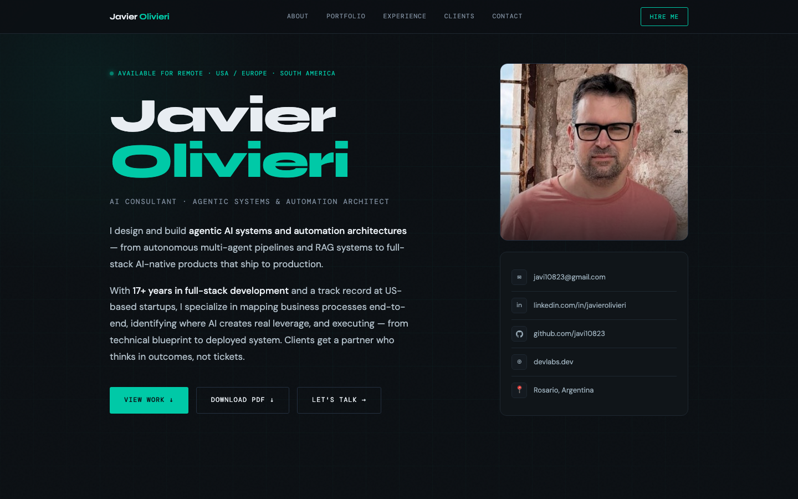

# Javier Olivieri — CV

Single source of truth, two outputs: a live web and an auto-generated PDF.

[](https://github.com/javi10823/javier-olivieri-cv/actions/workflows/build.yml)
[](https://cv-javier-olivieri-ai-consultant.netlify.app/)
[](LICENSE)
[](https://astro.build)
[](https://www.typescriptlang.org/)

**Live web:** [cv-javier-olivieri-ai-consultant.netlify.app](https://cv-javier-olivieri-ai-consultant.netlify.app/) · **PDF:** [cv.pdf (raw)](https://github.com/javi10823/javier-olivieri-cv/raw/main/public/cv.pdf)



## The problem this solves

My CV is a living document. Every time I add a project or change a role, I used to update the PDF by hand in a design tool *and* edit the website's HTML separately. They drifted apart in days. This repo collapses that into one editable surface: I edit a single typed TypeScript file, push, and both the web and the PDF regenerate themselves.

## How it works

```
src/data/cv.ts  ─►  Astro build  ─►  dist/index.html  ─►  Netlify (web)
                                ─►  /print route
                                      │
                                      ▼
                                Playwright (CI)
                                      │
                                      ▼
                                public/cv.pdf  ─►  committed to repo
```

A push to `main` triggers GitHub Actions: build the static site, render the `/print` route through headless Chromium with Playwright, export A4 PDF with backgrounds preserved, and commit the regenerated `cv.pdf` back to the repo (with a `[skip actions]` directive so the bot's own commit doesn't loop the workflow). Netlify watches `main` and redeploys on every push — both the human one and the bot's PDF refresh.

## Tech stack

- Astro (static site generator)
- TypeScript (strict)
- Tailwind CSS (utility-first styling)
- Playwright (PDF generation)
- GitHub Actions (CI)
- Netlify (hosting)

## Project structure

```
.
├── src/
│   ├── data/cv.ts          # Single source of truth — typed TS object
│   ├── layouts/Base.astro  # Shared <html>, fonts, meta
│   ├── components/         # Modular sections (Hero, Stack, Experience, …)
│   └── pages/
│       ├── index.astro     # Public web version
│       └── print.astro     # Print-optimized route used by Playwright
├── scripts/
│   └── generate-pdf.ts     # Playwright PDF exporter
├── public/
│   ├── cv.pdf              # Auto-generated, do not edit manually
│   └── hero.jpg            # Hero photo (web only, omitted in PDF)
└── .github/workflows/
    └── build.yml           # CI: build + PDF regen + commit
```

## Local development

```bash
pnpm install
pnpm dev          # Astro dev server at localhost:4321
pnpm build        # Production build → dist/
pnpm generate-pdf # Regenerate cv.pdf locally (requires `pnpm exec playwright install chromium` once)
```

Requires Node 22+ and pnpm 8+.

## Updating the CV

**Edit `src/data/cv.ts`. Push to `main`. Done.**

CI runs the build, regenerates `public/cv.pdf` from the new content, and commits the updated PDF back to the branch. Netlify autodeploys the resulting state. From the moment I `git push` to the moment the new web and the new PDF are live, hands-off in roughly 60–90 seconds.

## Design notes

- **Web and print share the same data model** but render different sections — the web shows portfolio cards and a contact form, the print version drops those and adds a Languages section. The split lives in the components, not the data.
- **The PDF is generated against a real route, not a separate template.** `/print` is a print-optimized version of the same Astro pipeline, served from the same `dist/` output. There is no parallel "PDF template" that can drift from the website.
- **Tailwind tokens defined once.** `@theme` in `src/styles/global.css` declares the dark palette, fonts, and accents used by both the web and the print layout, so the printed PDF and the live site share the same visual identity.
- **The bot commit uses `[skip actions]`, not `[skip ci]`.** GitHub Actions skips on either, but Netlify only skips on `[skip ci]` — using `[skip actions]` lets the regenerated PDF actually deploy.

## License

[MIT](LICENSE)

---

Built by Javier Olivieri · [devlabs.dev](https://devlabs.dev) · [linkedin.com/in/javierolivieri](https://linkedin.com/in/javierolivieri)
